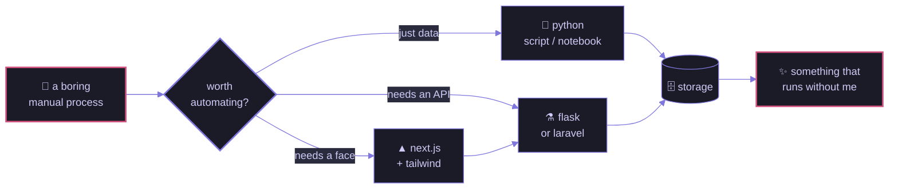

<div align="center">


</div>

```console
$ whoami
abha — software engineer @ odin outsourcing

$ cat ~/.focus
i build ai-powered tools that delete repetitive work.
if a human is doing it twice, it should be a script.

$ ls ~/stack
python/   laravel/   flask/   next.js/   typescript/

$ uptime
dhaka, bangladesh · UTC+6 · previously backend @ byteverse ltd

$ echo $CURRENTLY_LEARNING
cloud infrastructure & distributed systems
```

<div align="center">

[](mailto:esmechowdhuryabha@gmail.com)
<!-- TODO: replace YOUR_LINKEDIN_URL or delete this badge — right now it links to a 404 -->
[](YOUR_LINKEDIN_URL)
[](https://github.com/EsmeAbha)

</div>

---

## how i build things



---

## stack

<details open>
<summary><b>&nbsp;languages</b></summary>
<br/>


</details>

<details open>
<summary><b>&nbsp;backend</b></summary>
<br/>


</details>

<details open>
<summary><b>&nbsp;frontend</b></summary>
<br/>


</details>

<details open>
<summary><b>&nbsp;data & tooling</b></summary>
<br/>


</details>

---

## by the numbers

<p align="center">
  
  &nbsp;
  
</p>

---

<div align="center">

<sub>
  <code>$ exit</code> &nbsp;·&nbsp; thanks for stopping by &nbsp;·&nbsp;
  
</sub>

<br/><br/>


</div>
