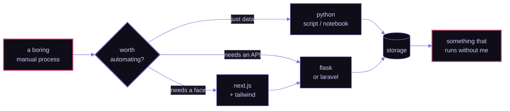

<div align="center">

<!-- A README is sandboxed by GitHub (Content-Security-Policy: default-src
     'none'; sandbox) and images are embedded through its camo proxy, so the
     banner carries no JavaScript: the particle motion is precomputed and baked
     into SMIL by scripts/gen-banner.js. -->


<br/><br/>

<!-- TODO: replace YOUR_LINKEDIN_URL and YOUR_RESUME_URL, or delete those two badges.
     As written they link to a 404. -->
[](YOUR_LINKEDIN_URL)
&nbsp;
[](mailto:esmechowdhuryabha@gmail.com)
&nbsp;
[](YOUR_RESUME_URL)
&nbsp;
[](https://github.com/EsmeAbha)

</div>

<br/>

## Hey there! I'm Abha 👋

**Backend Engineer & AI Tools Builder** · Dhaka, Bangladesh · she/her

I'm a Software Engineer at **Odin Outsourcing**, previously backend at **Byteverse Ltd**. I care about
the unglamorous half of software — the services, pipelines and jobs that quietly hold a product up
while nobody looks at them.

Most of what I build starts as someone doing something tedious by hand. I'm drawn to the moment a
manual process becomes a script, then an API, then something that just runs. My day-to-day work is
**Laravel** and **Python**, and it lives in private repos; what's public here leans toward data work
in **R** and **Jupyter**, plus **TypeScript** side projects. Currently going deeper on cloud
infrastructure and distributed systems.

<br/>

```console
$ whoami
abha — software engineer @ odin outsourcing

$ cat ~/.philosophy
if a human is doing it twice, it should be a script.

$ echo $NOW
learning: cloud infrastructure & distributed systems
```

<br/>


## How I build things




## Stack

<details open>
<summary><b>&nbsp;languages</b></summary>
<br/>


</details>

<details open>
<summary><b>&nbsp;backend</b></summary>
<br/>


</details>

<details open>
<summary><b>&nbsp;frontend</b></summary>
<br/>


</details>

<details open>
<summary><b>&nbsp;data &amp; tooling</b></summary>
<br/>


</details>


## By the numbers

<div align="center">


</div>

<sub>
Generated straight from the GitHub API by
<a href="scripts/gen-langs.sh">scripts/gen-langs.sh</a> and refreshed weekly by
<a href=".github/workflows/refresh-stats.yml">a workflow</a> — no third-party card service, so it
cannot rate-limit or go down. It counts <em>repositories</em> rather than bytes on purpose:
<code>.ipynb</code> files embed their own outputs, so byte-counting reports ~90% "Jupyter Notebook"
for this account, which describes the file format rather than the work.
</sub>

<br/><br/>

<div align="center">

<sub><code>$ exit</code> &nbsp;·&nbsp; thanks for stopping by</sub>

<br/><br/>


</div>
